### 详解ip地址
#### 局域网的概念
交换机：用于连接内网的多台设备，组成局域网
路由器：用于连接本地局域网和互联网
家用路由器：三层路由器，是路由器和交换机的集合体

#### ip地址
ip 地址由32位的二进制数字组成，最大255.255.255.255

#### 子网掩码
ip地址和子网掩码互相配合使用，有ip的地方必须使用子网掩码

局域网通信规则：在同一个局域网中，所有ip必须在同一网段才可以相互通信，如`10.1.1.1` 和`20.0.0.1`无法相互通信

ip地址构成：网络位+主机位，网络位相同的ip地址，为同一网段

子网掩码：用来确定ip地址的网络位

如何确定网络位：与255对应的数字为网络位，与0对应的数字为主机位，如`255.0.0.0` `255.255.0.0` `255.255.255.0`


如：一个教室为一个网段，如果不同教室为同一个网段，广播量太大，需要有二层路由器的接入才可以完成广播，组成局域网的交换机无法完成

#### ip地址详解
国际标准ios定位地址分类：五大类，是以ip地址的第一位进行区分的

A类：1-126，默认子网掩码 `255.0.0.0`
B类：128-191，默认子网掩码 `255.255.0.0`
C类：192-223，默认子网掩码 `255.255.255.0 `
D类：224-239，组播地址，ABC类为单播地址，一个地址对应一个机器；组播地址对应一组机器，同一个数据发送方只需要向组播地址发送一次
E类：240-254，科研使用

注
1. 目前我们可以使用的只有 A B C 三类地址
2. A B C 三类地址的子网掩码可以修改

每个网段有三种地址
1. 网段名称，把该网段的主机位全部置0
2. 广播地址，该网段的主机位全为255
3. 剩下的为可用ip地址

案例1
ip`10.1.1.1`，子网掩码`255.255.255.0`，ip属于什么网段？所在网段有多少个可用的ip地址？该网段的广播地址是什么？
1. `10.1.1.1`属于`10.1.1.0`网段
2. `10.1.1.0`网段可用的ip地址范围：`10.1.1.1`~`10.1.1.254`
3. `10.1.1.0`网段的广播地址：`10.1.1.255`，代表该网段的所有人，交换机会将该ip地址收到的网络包向所有人发送
4. `255.255.255.255`全局广播地址，进行网络隔断后，`10.1.1.255`和`255.255.255.255`效果一致

案例2
ip`10.1.1.1`，子网掩码`255.255.0.0`，ip属于什么网段？所在网段有多少个可用的ip地址？该网段的广播地址是什么？
1. `10.1.1.1`属于`10.1.0.0`网段
2. `10.1.0.0`网段可用的ip地址范围：`10.1.0.1`~`10.1.255.254`
3. `10.1.1.0`网段的广播地址：`10.1.255.255`

`127.0.0.1` 回环地址，代表本机，如可用于检查网卡是否损坏 

#### 网关
网关：一个网络的出口，GateWay=GW，一般网关是在路由器上

路由器：可用于连接内外网的设备

路由器在内网局域网内有一个ip地址，习惯用于该网段的第一个或最后一个ip作为网关，路由器该接口也是局域网的一部分，称为内网的出口

pc向外发包
1. 判断目标ip地址与自己是否为同一网段
2. 如在同一网段，则直接发出去，不找网关
3. 不在同一网段，则直接发包给网关

#### DNS
DNS: Domain Name Service 域名服务

##### 测试网络连通性
```shell
ping ip地址或域名
ping -t ip          # 一直ping
ping -n 数字 ip地址  # 修改ping包数量
ping -l 数字 ip          # 数据报的长度
```

##### 手工解析域名
`nslookup www.baidu.com`

#### DHCP
##### 概念
主机ip自动分配协议，减少工作量，避免ip冲突、提高ip地址利用率

##### 相关概念
地址池/作用域：ip、子网掩码、网关、DNS、租期

##### DHCP原理
也称为DHCP租约过程
1. 发送DHCP Discovery广播请求：客户机不知道DHCP服务在哪，广播请求IP地址，包含客户机的MAC地址
2. 相应DHCP Offer广播包：提供ip地址，但无子网掩码、网关等参数
3. 客户机发送DHCP Request广播包：可能有收到了多个DHCP服务器的相应，确定ip后请求后续的信息
4. DHCP服务器发送DHCP ACK广播包：服务器确定了租期，更新租约配置表和地址池信息，并提供ip相关详细参数

DHCP攻击
1. 伪装mac地址，不断请求ip地址。防御：功能型交换机，动态mac地址绑定，在第一次请求时，记录ip和mac地址对应关系
2. 伪装DHCP服务器，分配错误的ip地址，导致在ip地址和局域网网段不同，请求无法发送出去。防御：功能性交换机，组织任何人发送offer包，除了指定的交换机

##### DHCP续约
当使用时间超过50%，客户机再次发送DHCP Request包，从此刻开始算，向后续约一个租期的时间，一般DHCP服务器会返回一个ACK包

公共场合，比如肯德基，DHCP租期短一点好，相应的DHCP服务器会较为繁忙

如果设备关机了，开机会发送DHCP Request包，DHCP发现租期没到，继续分配该ip地址

如果续约时DHCP服务器无响应，则继续在87.5%租期时，发送的DHCP Request包进行续约，如果仍无响应，清除网卡的ip相关信息，重新发送DHCP Discovery包申请ip地址

当获取不到ip地址时，网卡会给自己设置一个无效的ip地址 `169.254.x.x/16`，属于全球统一的无效地址，用于局域网临时通信

##### 客户机释放&重新获取ip地址
`ipconfig /release   释放ip`
`ipconfig /renew     重新获取ip，有ip时发送request包，无ip时发送discovery重新获取ip`

##### 地址保留
对指定的MAC地址，固定动态分配的ip地址

##### DHCP备份
将DHCP服务器信息备份，删除后可恢复

##### 选项优先级
一个DHCP服务器可以配置多个作用域对应多个网段
作用域选项 > 服务器选项
当服务器有多个作用域时，可以在服务器选项上设置DNS服务器，多网段使用该DNS服务器


#### DNS服务器
##### DNS服务器作用
为客户机提供域名解析的服务

##### 域名的组成
如`www.sina.com.cn`是一个域名，从严格意义上讲，`sina.com.cn`才被称为域名（全球唯一），`www`是主机名

`主机名,域名`成为完全限定域名 FQDN，一个域名下可以有多个主机，域名全球唯一，所以`域名.主机名`也是全球唯一

以`sina.com.cn`域名为例，一般管理员在命名其主机时会根据其主机的功能而命名，比如网站是www，博客是blog，论坛是bbs
对应的FQDN为`www.sina.com.cn`，`blog.sina.com.cn`，`bbs.sina.com.cn`，多个FQDN只需要申请一个域名`sina.com.cn`即可，一般对应不同的ip

##### 域名的组成
1. 根域 `.`
2. 顶级域名 `com` `net` `org` `edu`
3. 一级域名 `cctv` `qq`
4. 二级域名 `mail` `www` `bbs`

```
如：www.baidu.com.
最后的 . 成为根域，必须要有，但一般不用写，浏览器会补充 
baidu为一级域名
www为主机名

FQDN(完整合格的域名)=主机名.DNS后缀
```
##### DNS服务器端口号
`TCP53 UDP53`

##### DNS解析种类
按照查询方式分类
1. 递归查询:客户机与本地DNS服务器之间（有问有答，本地DNS服务器转发查询请求到公网DNS服务器，也是递归查询）
2. 迭代查询:本地DNS服务器与根等其他DNS服务器的解析过程

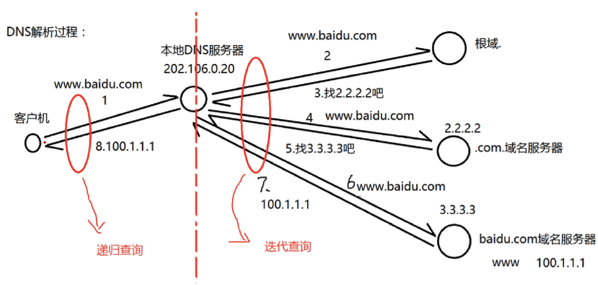


按照解析内容分类
1. 正向解析:已知域名，解析ip地址
2. 反向解析:已知ip地址，解析域名

##### DNS服务器相关知识
SOA:某个域名的全为服务器，只能有有一台，此服务器解析出来域名的ip地址为权威应答，其余解析皆为非权威应答
NS（name server）:名称服务器，可以有多台
A记录:正向解析，配置FQDN对应的ip地址
CNAME:别名，指向另一个域名

##### 桥接
虚拟机的vmnet0网卡，可以桥接到真实的局域网中

#### osi五层模型

##### 五层模型与七层模型
五层模型将应用层、表示层、会话层合并

每一层都会加上相应的信息，只有数据链路层会在尾部加上`FCS frame check swquence`数据

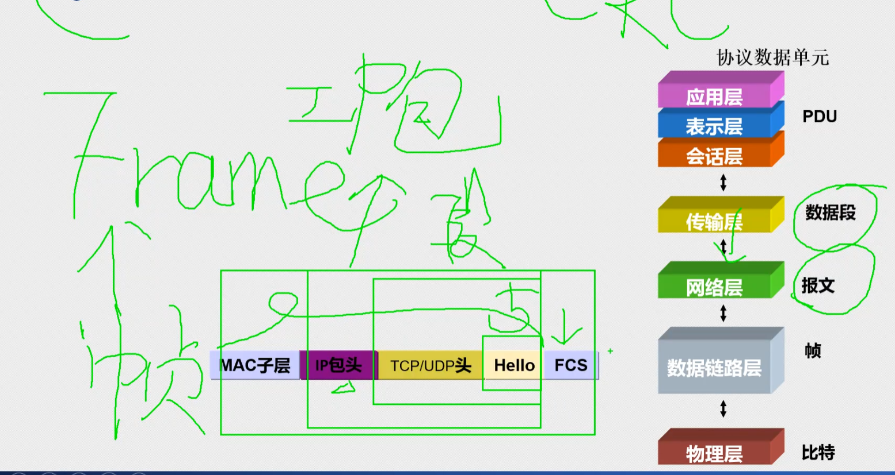

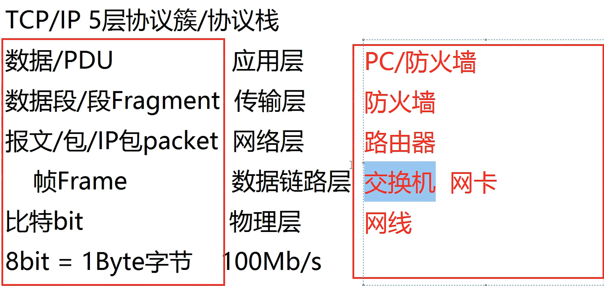

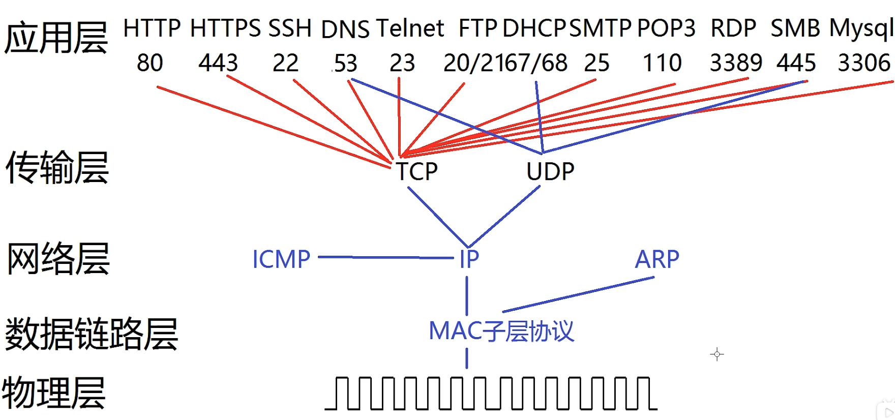

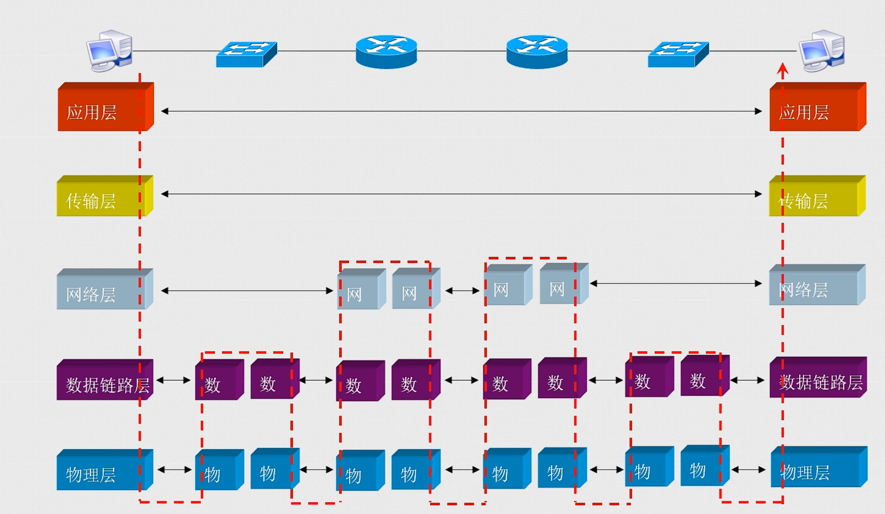

表示层会将应用层的数据（图片、视频、文字等）编码为比特流，会将比特流解码成原有的数据

会话层帮助应用管理不同的传输层连接，如qq可能需要和不同的服务器建立连接

应用层才有端口号，应用层决定使用的端口号，传输层会使用被告知的端口号进行传输工作

##### 物理层

网线/光纤/空气 等可以充当物理层的介质


电信号
模拟型号 -> 放大器
数字信号 -> 中继器，数字脉冲衰减快，经过中继器后复原


光信号
1. 单模光纤: 只传输一种光，传输距离和带宽高，用于远距离传输，一般为黄色
2. 多模光纤: 可以传输多种光，用于短距离传输，如机房，一般为蓝色/橙色


网线/双绞线
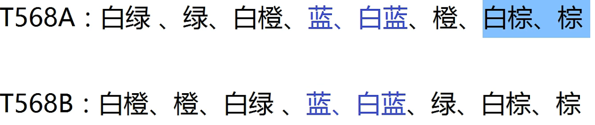

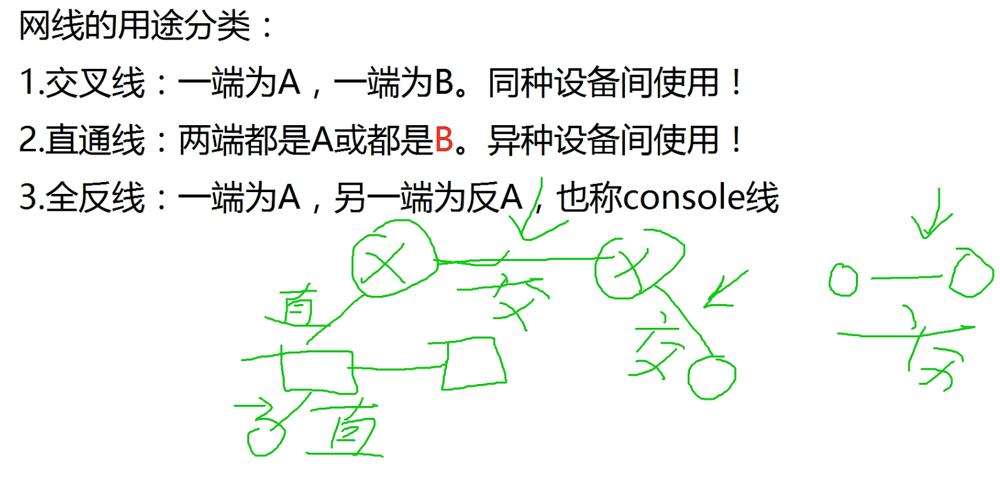

#### 数据链路层

##### 帧
数据链路层的传输单元是帧

帧格式
1. 有线网卡802.3
2. 无线网卡802.11

帧类型，识别上层协议，为上层提供服务
1. 0x0800 上层使用ip协议
2. 0x0806 上层使用arp协议

帧头：6+6+2=14字节
MTU：1500字节
帧尾：4字节

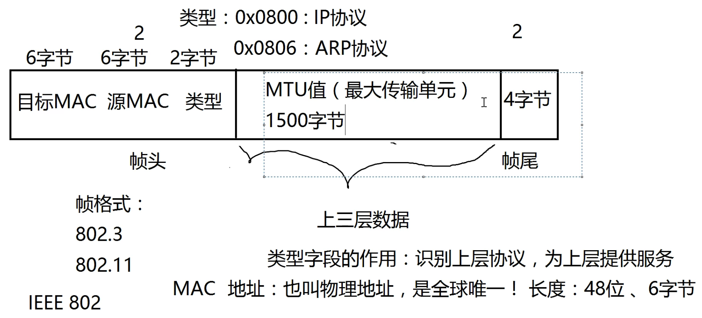

mac地址，也叫物理地址，全球唯一长度48位，6字节

在数据传输的过程中，帧头和帧尾会不断变化，对上层透明

工作在数据链路层的设备：网卡/交换机，网卡生成帧，交换机读取帧内容并转发

##### 交换机工作原理


1. 新的交换机sw1，收到了`MAC AA`的帧，目的`MAC DD`，此时sw1记录接口`F0/1`对应`MAC AA`到MAC表
    > 交换机通过记录源MAC地址到MAC表，不会关心真正的MAC地址
2. 交换机sw1没有`MAC DD`的接口信息，因此向所有接口广播该帧
3. 设备`MAC BB`收到这个帧，和本机MAC不匹配，丢弃帧
4. sw2收到帧，在MAC表记录接口`F0/2`对应`MAC AA`
    > 同一局域网内，交换机不会改变帧头帧尾，仅转发
5. sw2向所有端口广播，设备`MAC CC`丢弃这个帧，设备`MAC DD`正确收到这个包
6. 设备`MAC DD`向设备`MAC AA`回包，sw1 sw2将帧通过MAC表的接口发送，并更新`MAC BB`到MAC表


交换机的转发方式
1. MAC表中有记录，向特定接口转发
2. MAC表中无记录，向所有接口转发

如果看到MAC表中，某个接口对应了多个MAC地址，说明该接口连接了一个交换机

MAC表更新
1. MAC表的生命周期为300s
2. 接口收到不同的MAC地址时，会立刻更新MAC表

***交换机用于连接同一网段，路由器用于连接不同网段***

##### ping工作流程
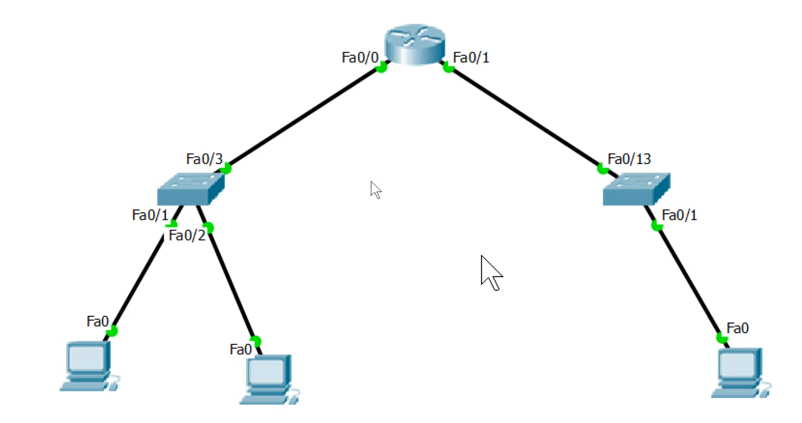

网段a的a1，ping网段b的b1
1. a1发现ping的b1在不同网段，将数据报发送到网关
2. 网关将数据报发送到b1
3. b1收到ping请求，准备给a1回包，但在不同网段，因此将数据报发送给路由器
4. 路由器将回包转发给a1

#### 网络层

##### IP数据报格式
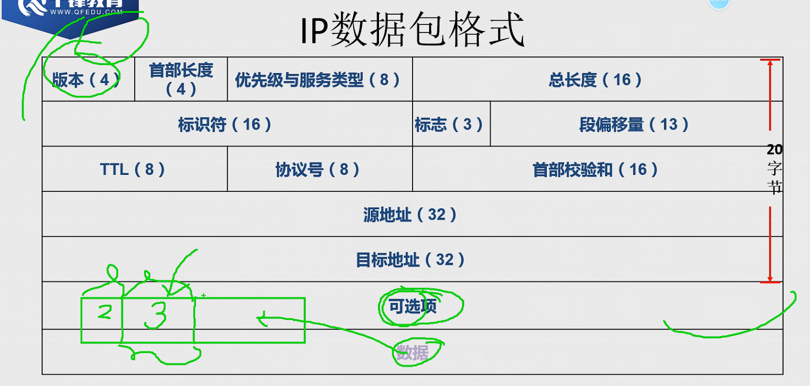

1. 版本(4bit)，4 -> ipv4，6 -> ipv6
2. 首部长度(4bit)，ip数据包头的长度，20~40字节
3. 优先级与服务类型(8bit)，
   1. 前面3bit为优先级，代表该数据包的优先级，如vip用户的数据包优先
   2. 中间5bit为服务类型

4. 总长度(16bit)，指ip包的总长度，数据链路层MTU为1500，传输的数据报为4000字节，此时需要IP数据包分片传输，该字段记录总长度4000
5. 标识符(16bit)，每个完整的数据包，都有随机生成的一个字符串作为标识符，如果分片，则各分片的标识符相同
6. 标志(3bit)，第一个bit =0为未启用，第二个bit代表是否开启分片 =0代表进行了分片，第三个bit =1代表还有后续分片
7. 段偏移量，第一个包，偏移量 =0，第二个包 =1480，第三个包 =2960，用于将ip分片组合成完整的ip包
8. TTL，在互联网上可以经过多少次路由器转发，每经过一个路由器，路由器将该ip头部的TTL -1，直至 ttl=0 时，丢弃该ip包，并向源主机发送丢弃说明
   1. linux的ttl一般在100一下，windows一般在100以上
   2. 通过将ttl设置为1,2,3...，可以得到数据包到目标服务器的详细路径
9. 协议号，ICMP，TCP，UDP
10. 首部校验和，该首部的校验

三层分片
ip包的内容是完整的，若长度 >MTU，将其内容分为多个ip包数据，各部分数据加上ip头，分别转发，由接收方组装成完整的ip包

DDS攻击
1. 发送段偏移量错误，且标识符相同的多个ip分片包，使得目标主机不断进行合包，消耗cpu资源
2. 若允许ip包分片，会收到三层DDS攻击，一般不允许ip包分片，将分片交给上层的传输层控制，将受影响范围缩小至一个软件
3. 防火墙丢弃DDS攻击同样需要耗费资源，最后的办法是将ip包特征告诉运营商，进行数据清洗

##### 路由原理

路由
跨越从源主机到目标主机的一个互联网络来转发数据包的过程
路由器为ip包选择路径的过程

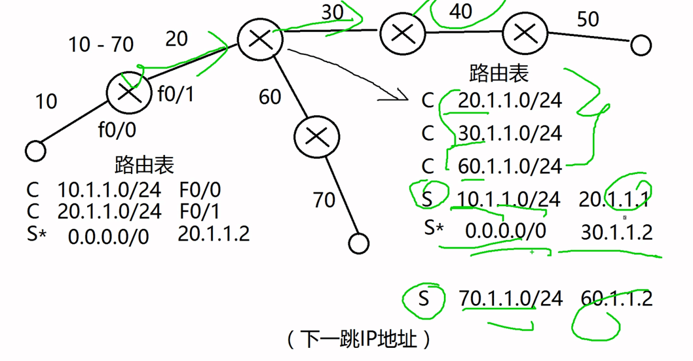

路由器连接多个不同的网络（具有不同的网段），因此每个端口在此网段有一个对应的ip地址

路由转发的规律：依据路由表记录转发，如果路由表没有对应配置，则丢弃，并向源主机返回目标地址不可达提示

路由表的记录标识
1. C，直接相连的端口，属于什么网段，优先级最高，默认管理距离值 =0
2. S，手工配置的路由，目标网段 -> 下一跳地址，默认管理距离值 =1
3. S*，手工配置的默认路由，0.0.0.0/0 -> 下一跳地址，配置以后该路由器不会再因为找不到路由方向丢包，默认管理距离值 =∞
4. 同一个网段，可以配置多个路由条目，优先级高的会先匹配，优先级低的会隐藏，直至优先级高的消失后重新出现

边缘路由器，配置一个默认路由即可；路由表中的条目越少越好，遍历速度更快

##### ARP协议

广播：将广播地址作为目的地址的数据帧（2层、3层）
广播域：网络中能接收到同一个广播多有节点的集合

mac广播地址：`FF-FF-FF-FF-FF-FF`

ip广播地址：
1. `255.255.255.255`
2. 广播ip地址为ip地址网段的广播地址，如 `192.168.1.255/24`

交换机无法控制广播，收到请求就会进行广播；路由器隔离广播域，不会进行广播

ARP协议
- address resolution protocol 地址解析协议
- 将一个已知的 ip地址 解析成 MAC地址
- 工作流程
  1. 发送ARP广播请求，带上自己的ip地址与mac地址
  2. 收到ARP单播应答
  3. 保存ARP缓存
- ARP协议是局域网协议，不能经过路由器

只有三层设备，才会有mac地址，二层交换机的接口只负责数据帧转发，直连下一个设备的mac地址接口，因此没有mac地址

ARP攻击原理
通过发送伪造虚假的ARP报文（广播或单播），实现攻击或欺骗

如果虚假ARP报文的mac地址是伪造的不存在的，实现ARP攻击，结果是中断通信、断网（混淆网关mac地址）

如果虚假ARP报文的mac地址是攻击者自身的mac地址，实现ARP欺骗，数据帧先到达，结果可以监听、窃取、篡改数据内容、控制流量，但不会中断通信